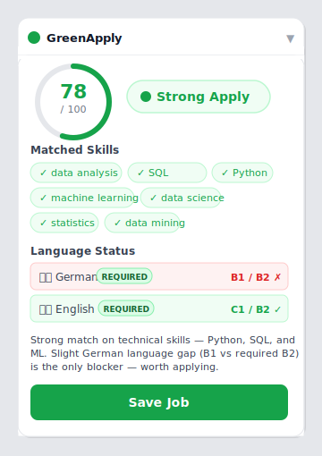
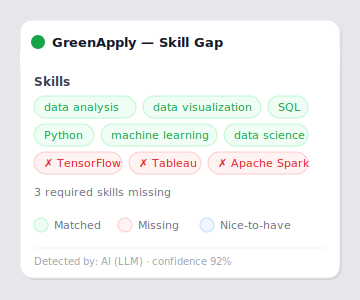
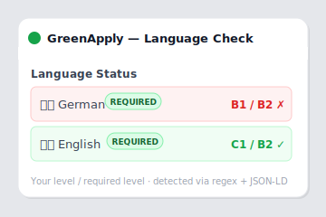
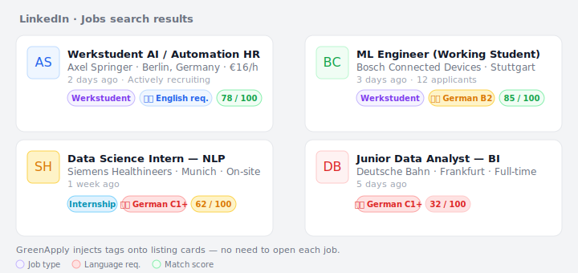
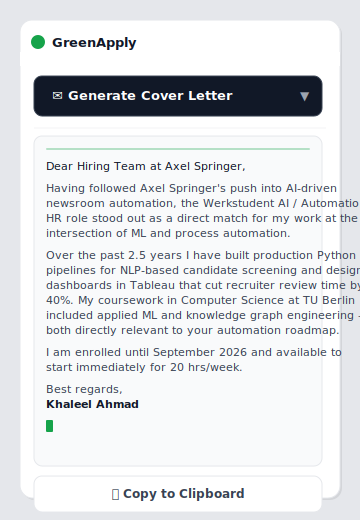
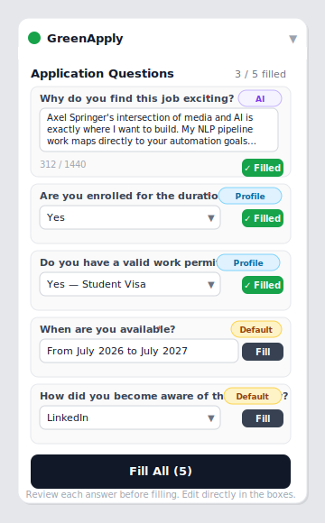
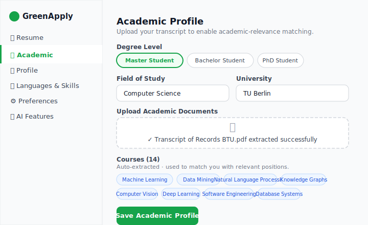

<div align="center">
  
  <h1>GreenApply</h1>
  <p><strong>Know before you apply.</strong><br/>Instant job fit scoring for international students and professionals in Germany.</p>

  <p>
    
    
    
  </p>
</div>

---

## What this does

GreenApply is a Chrome extension that sits next to job listings and shows how well a role matches your profile before you spend time on an application.

Open a job on LinkedIn, Stepstone, SuccessFactors, or many other platforms and you get a match score, a clear recommendation, a skill gap breakdown, and a language check in seconds.

## Key features

### Instant match scoring

Each job page receives a 0 to 100 score and a colour coded recommendation as soon as you open it. The score compares skills, language needs, employment type, location, experience, and salary with your profile.

<div align="center">
  
</div>

Verdicts: 🟢 Strong Apply · 🟡 Consider · 🟠 Stretch · 🔴 Skip

### Skill gap analysis

See which skills match the job, which are missing, and which are optional at a glance.

<div align="center">
  
</div>

### Language requirement check

GreenApply extracts explicit German and English requirements from job descriptions using a layered approach and compares them to your CEFR levels so you spot language needs early.

<div align="center">
  
</div>

### Feed annotations

On job listing pages, GreenApply adds quick read tags to job cards so you do not need to open every listing.

<div align="center">
  
</div>

Tags include language requirements, job type, and a match score badge where available.

### Cover letter generator

One click produces a tailored cover letter that references your skills and relevant experience. The text is editable so you can refine the tone before sending.

<div align="center">
  
</div>

### Application form autofill

When you reach an application form on platforms like SmartRecruiters, Greenhouse, or Workday, GreenApply recognises common questions and suggests answers based on your profile.

<div align="center">
  
</div>

Question sources include your academic profile and sensible defaults. All suggested answers are editable before you submit.

### Academic profile

Upload a transcript or enrollment letter and GreenApply extracts courses, certifications, and degree level to improve academic relevance in scoring and in cover letters.

<div align="center">
  
</div>

## Supported platforms

### ATS platforms

| Platform | Coverage |
|---|---|
| SAP SuccessFactors | `*.successfactors.com`, `*.successfactors.eu` |
| Oracle Taleo | `*.taleo.net` |
| Greenhouse | `boards.greenhouse.io` |
| Lever | `jobs.lever.co` |
| Workday | `*.myworkdayjobs.com` |
| SmartRecruiters | `jobs.smartrecruiters.com` |
| BambooHR | `*.bamboohr.com` |
| Personio | `*.personio.de` |
| Ashby | `jobs.ashbyhq.com` |
| iCIMS | `*.icims.com` |
| Recruitee | `*.recruitee.com` |
| softgarden | `*.softgarden.de` |

### Job boards

| Platform | Region |
|---|---|
| LinkedIn | Global |
| Indeed | Global |
| Glassdoor | Global |
| Monster | DE / Global |
| Stepstone | DE |
| Xing | DE / DACH |
| JobTeaser | EU (students) |
| Absolventa | DE (students) |
| Workwise Campusjager | DE (students) |
| JOIN | DE (startups) |
| Jobware | DE |
| Fetchjobs | DE |
| TU Berlin Jobs | DE |

Any company career page is handled automatically using JSON LD and DOM extraction.

## Getting started

### Prerequisites

- Chrome or Chromium 120 or later
- Node.js 20 or later

### Installation for development

```bash
git clone https://github.com/yourusername/greenapply.git
cd greenapply
npm install
npm run build
```

1. Open Chrome and go to `chrome://extensions`
2. Enable Developer mode (top right)
3. Click Load unpacked and choose the `dist/` folder

### Setup

1. Click the GreenApply icon and open Settings
2. Resume tab — upload your PDF or DOCX resume (parsed locally, not uploaded)
3. Languages and Skills tab — verify detected languages and skills and adjust CEFR levels
4. Academic tab — upload your transcript to enable academic matching
5. Preferences tab — set job types, remote preference, and minimum salary
6. Optional features tab — configure any external services you want to use

## How scoring works

```
Score = Skills × 35%
      + Language × 25%
      + Experience × 15%
      + Location × 10%
      + Employment Type × 10%
      + Salary × 5%
      + Academic relevance modifier (±10 pts)
      + Job freshness modifier (±3 pts)
```

Hard filters such as visa restrictions, wrong employment type, or excluded companies cap the score and change the recommendation to Skip regardless of other factors.

## Tech stack

| Layer | Technology |
|---|---|
| Extension framework | Chrome MV3, CRXJS and Vite |
| UI | React 19, inline styles |
| Optional inference | Configurable external service |
| Storage | IndexedDB using `idb` |
| PDF parsing | `pdfjs-dist` |
| DOCX parsing | `mammoth` |
| Language | TypeScript 5.7 |

## Privacy

- Resume parsing happens locally in your browser
- Job data and your profile remain in local IndexedDB and are not sent to a server by default
- No analytics, no tracking, no accounts required

## License

MIT
