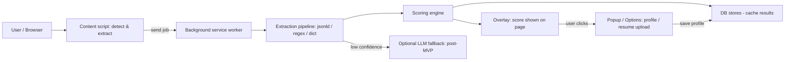

# GreenApply — Understanding Guide (non-technical)

This document explains, in plain language, how the GreenApply project is organized and how the pieces fit together. It is written for a reader who is not a programmer and describes the role of each major file or folder, how features are built from those files, and the overall workflow a user experiences.

---

## At-a-glance: what GreenApply does

- GreenApply is a browser extension (Chrome / Chromium) that inspects job postings and tells a job seeker whether the job is worth applying for.
- It analyzes the job text (requirements, languages, visa notes, salary) and compares it to the user's profile (resume, languages, preferences) to produce a deterministic score and recommendation (green/yellow/orange/red).

## Technologies used (short)

- Primary language: TypeScript (a typed version of JavaScript).
- UI: React (web UI components written in `.tsx` files) and Tailwind CSS for styles.
- Browser extension system: Manifest V3 (Chrome extension format).
- Storage: IndexedDB (local database in the browser) and `chrome.storage.local` for small settings.
- File parsers: `pdfjs-dist` for PDF and `mammoth` for DOCX extraction.
- Optional AI: NVIDIA NIM integration is prepared for post‑MVP features.

---

## High level architecture (simple)

- Content code (runs inside web pages): detects job postings, extracts the visible job text, and injects the overlay UI (the small badge or panel you see on job pages).
- Background code (a persistent service worker): receives messages from the content code, runs extraction logic (tries structured data first, then heuristics), runs scoring, stores results, and generates optional AI summaries.
- Overlay / Popup / Options (UI): React screens that show the score, allow uploading resumes, editing preferences, and viewing tracked jobs.
- Database: simple local stores that cache job extractions, matches, profiles and user preferences so the extension is fast and works offline.

---

## Step-by-step user flow (what happens when you use the extension)

1. The user installs the extension and opens a job listing page (LinkedIn, StepStone, Greenhouse, etc.).
2. The content script (page code) detects the job listing and extracts the raw job text and metadata.
3. The content script sends the raw job data to the background service worker.
4. The background worker runs the extraction pipeline to identify required skills, languages, visa text, salary, and date posted.
5. The scoring engine compares the extraction result to the user's saved profile (resume and preferences) and computes a numerical score and recommendation.
6. The overlay UI is rendered on the page showing the score and any hard filters (blockers) or caveats.
7. If the user opens the popup or options page, they see saved results, can upload a resume, and change preferences.

---

## Where to find the main pieces in the code (file guide)

Below are the most important folders and example files with short, non-technical descriptions.

- `src/manifest.ts` — Entry manifest for the browser extension. It lists which scripts run where (content, background, popup).

- `src/content/` — Code that runs inside web pages:
  - `src/content/index.ts` — Main entry: decides whether the page looks like a job posting.
  - `src/content/detectors/` — Rules that recognize different job platforms (LinkedIn, Indeed, etc.).
  - `src/content/extractors/` — Code that pulls the job text from the page DOM.
  - `src/content/overlay-mount.tsx` and `src/overlay/` — Mount the visual overlay (badges, small panels) inside the page.

- `src/background/` — Service worker and background logic (the brains):
  - `src/background/index.ts` — Background entry: receives messages and routes them to handlers.
  - `src/background/handlers/` — Each handler handles a type of request (profile, job, match, generate, tracker).
  - `src/background/extraction/` — The extraction pipeline and extractors (JSON-LD, regex, dictionaries).
  - `src/background/parsers/` — Parsers for uploaded files (PDF, DOCX, transcripts, resume parsing helpers).
  - `src/background/scoring/` — Deterministic scoring: hard filters, scoring engine, freshness adjustments.
  - `src/background/nim/` — Optional AI integrations (LLM-based summarizers / generators) prepared for later phases.

- `src/background/db/` — Local stores (IndexedDB wrappers) that keep profiles, jobs, matches, and application history.

- `src/popup/` and `src/options/` — Full UI pages a user opens from the extension (dashboard, job list, profile editor, API key form).

- `src/overlay/` — React components that are shown on top of job pages (ScoreRing, RecommendationBadge, HardFilterAlert).

- `src/types/` — Type definitions that describe the shape of data used across the app (profile, job, match, application). These are helpful to developers but not required to use the extension.

---

## How the main features are composed (plain explanation)

- Detecting a job page: the content code runs small detectors tailored to known platforms. A detector checks the page URL and looks for characteristic HTML structures. If a detector matches, the extractor pulls the job title, company, location, and the job description text.

- Extraction (structured → heuristic): the background tries to use structured data such as JSON-LD (a machine-readable format on many job pages). If JSON-LD is missing or incomplete, it falls back to pattern matching (regular expressions) and a small dictionary of skills to pull out named skills and experience requirements. Each field receives a confidence score (how sure the code is about the extraction).

- Scoring: the scoring engine is a deterministic formula (no AI needed for MVP). It applies hard filters first (immediate blockers such as "German C1 required" when the profile says A2), then computes weighted sub-scores (skills match, experience, languages, visa compatibility, salary match). The final score is a number between 0–100 and is mapped to a recommendation color.

- Overlay display: the overlay receives the final match and displays the score ring, a recommendation pill, and any hard filter warnings. The UI includes an explanation section with missing skill highlights and confidence caveats.

- Resume upload & parsing: the options page allows uploading a PDF or DOCX resume. The file parsers extract text (using PDF and DOCX libraries), and the deterministic resume parser finds skills, languages, job titles, and experience years. The parsed profile is stored locally for future matches.

- Optional AI features (post-MVP): when a user provides an API key, the extension can ask a language model to explain the numeric score in plain language or to generate a tailored cover letter. The code base contains placeholders for NVIDIA NIM integration.

---

## Simple data flow (visual)

---

## How files talk to each other (messaging, simply)

- The content script (page) and background service worker communicate using the browser's messaging system. The page says "here is a raw job" and the background replies with a match and score. Those messages are handled by `src/background/handlers/*` files.
- The background stores results in `src/background/db/*` so the overlay and popup can read them later without re-computing.

---

## Where to start if you want to explore or verify behavior (non-technical path)

1. Open `src/content/index.ts` to see how the extension recognizes pages.
2. Open `src/content/extractors/generic.extractor.ts` to see how raw text is pulled from most sites.
3. Open `src/background/extraction/pipeline.ts` to see the extraction steps (structured → regex → dictionary).
4. Open `src/background/scoring/engine.ts` to see how the final number is computed.
5. Open `src/overlay/Overlay.tsx` to see what the user sees on the page.

These files are written in readable TypeScript. If you want help opening or stepping through a specific file, tell me which file and I can summarize it line-by-line.

---

## Glossary (plain)

- Content script: code that runs inside the web page you visit.
- Background worker: a small program that runs separately from page code, does heavier work, and keeps data.
- Extractor: code that pulls information out of a job posting.
- Scoring engine: the code that turns extracted data into a 0–100 score and color recommendation.
- Overlay: the small UI you see on job pages with the score and badge.

---

## Next steps (for product / QA)

- Verify resume upload with a sample PDF and check that parsed skills appear in the options page.
- Visit a few job listings (LinkedIn, Indeed) and confirm the overlay shows a score.
- Run the optional deep audit to confirm all runtime messaging and caching are working.

---

---

## Documentation links (learn before you code)

All technologies used in GreenApply, grouped by area. Read these to understand how each piece works before writing the code for that phase.

---

### Core language

| Topic | Why you need it | Link |
|---|---|---|
| TypeScript handbook | Every file is `.ts` / `.tsx`; you need to understand types, interfaces, generics | https://www.typescriptlang.org/docs/handbook/intro.html |
| TypeScript for JS programmers | Quick on-ramp if you already know JS | https://www.typescriptlang.org/docs/handbook/typescript-in-5-minutes.html |

---

### UI layer

| Topic | Why you need it | Link |
|---|---|---|
| React – Quick Start | All popup, options, and overlay screens are React components | https://react.dev/learn |
| React – Hooks reference | `useState`, `useEffect`, `useRef` used everywhere | https://react.dev/reference/react |
| React – Thinking in React | How to break a UI into components | https://react.dev/learn/thinking-in-react |
| JSX / TSX syntax | `.tsx` files mix HTML-like syntax with TypeScript | https://react.dev/learn/writing-markup-with-jsx |
| Tailwind CSS v4 – docs | All styling is utility classes; no custom CSS files | https://tailwindcss.com/docs/installation |
| Tailwind – utility class reference | Look up any class (flex, grid, colors, spacing) | https://tailwindcss.com/docs/utility-first |

---

### Build tooling

| Topic | Why you need it | Link |
|---|---|---|
| Vite – Getting Started | The build tool that bundles the extension | https://vitejs.dev/guide/ |
| Vite – config reference | How `vite.config.ts` works | https://vitejs.dev/config/ |
| @crxjs/vite-plugin | The plugin that turns Vite into a Chrome extension builder (handles manifest, HMR) | https://crxjs.dev/vite-plugin |
| @crxjs – GitHub repo | Source + issues; useful because docs are sparse | https://github.com/crxjs/chrome-extension-tools |

---

### Chrome extension system (Manifest V3)

This is the most important area to understand deeply before writing any extension code.

| Topic | Why you need it | Link |
|---|---|---|
| MV3 overview | The overall architecture: what each part does | https://developer.chrome.com/docs/extensions/mv3/intro/ |
| Manifest file format | `manifest.json` declares all permissions, scripts, pages | https://developer.chrome.com/docs/extensions/mv3/manifest/ |
| Content scripts | Code that runs inside web pages (your `src/content/` folder) | https://developer.chrome.com/docs/extensions/mv3/content_scripts/ |
| Service workers (background) | The background script — what it can and can't do | https://developer.chrome.com/docs/extensions/mv3/service_workers/ |
| Message passing | How content script ↔ background talk (`sendMessage`, ports) | https://developer.chrome.com/docs/extensions/mv3/messaging/ |
| Long-lived connections (ports) | `chrome.runtime.connect()` — needed for streaming (cover letter) | https://developer.chrome.com/docs/extensions/mv3/messaging/#connect |
| chrome.storage API | `chrome.storage.local` for profile + API key | https://developer.chrome.com/docs/extensions/reference/storage/ |
| chrome.storage.session | Per-tab job state storage (cleared when browser closes) | https://developer.chrome.com/docs/extensions/reference/storage/#property-session |
| host_permissions | Why `*://*/*` is used instead of a list of sites | https://developer.chrome.com/docs/extensions/mv3/declare_permissions/#host-permissions |
| Permissions reference | Full list of what each permission does | https://developer.chrome.com/docs/extensions/mv3/declare_permissions/ |

---

### Browser APIs used in content scripts

| Topic | Why you need it | Link |
|---|---|---|
| Shadow DOM | The overlay is mounted in a closed shadow DOM to avoid CSS clashes | https://developer.mozilla.org/en-US/docs/Web/API/Web_components/Using_shadow_DOM |
| adoptedStyleSheets | How Tailwind CSS is injected into the shadow DOM (CSP-safe) | https://developer.mozilla.org/en-US/docs/Web/API/Document/adoptedStyleSheets |
| MutationObserver | Detects when a SPA (LinkedIn, etc.) loads a new job without a full page reload | https://developer.mozilla.org/en-US/docs/Web/API/MutationObserver |
| History API | `pushState` / `replaceState` patching — how SPA navigation is detected | https://developer.mozilla.org/en-US/docs/Web/API/History_API |
| DOM querying | `querySelector`, `querySelectorAll`, `getAttribute` — used by all extractors | https://developer.mozilla.org/en-US/docs/Web/API/Document/querySelector |

---

### Storage

| Topic | Why you need it | Link |
|---|---|---|
| IndexedDB concepts | The local database that stores resumes, jobs, matches | https://developer.mozilla.org/en-US/docs/Web/API/IndexedDB_API/Basic_Terminology |
| idb library (wrapper) | The library used to talk to IndexedDB with a clean Promise API | https://github.com/jakearchibald/idb |
| idb – API reference | The actual methods: `openDB`, `get`, `put`, `delete`, `transaction` | https://github.com/jakearchibald/idb#api |

---

### File parsers

| Topic | Why you need it | Link |
|---|---|---|
| pdfjs-dist | Parses uploaded PDF resumes to extract text | https://mozilla.github.io/pdf.js/ |
| pdfjs-dist – npm usage | How to use it in a bundled project (worker setup is tricky) | https://www.npmjs.com/package/pdfjs-dist |
| mammoth.js | Converts uploaded DOCX resumes to plain text | https://github.com/mwilliamson/mammoth.js |

---

### Structured data on job pages

| Topic | Why you need it | Link |
|---|---|---|
| JSON-LD intro | A machine-readable format many job sites embed in `<script>` tags | https://json-ld.org/ |
| Schema.org JobPosting | The exact fields you will parse (`title`, `description`, `baseSalary`, etc.) | https://schema.org/JobPosting |
| JSON-LD in HTML | How to find and read it in a page (`<script type="application/ld+json">`) | https://json-ld.org/learn/documents/html-api-demo.html |

---

### AI / NIM integration (post-MVP phases)

| Topic | Why you need it | Link |
|---|---|---|
| NVIDIA NIM overview | The AI API used for scoring, cover letters, skill extraction | https://docs.nvidia.com/nim/ |
| NIM API reference (OpenAI-compatible) | Same `/v1/chat/completions` pattern; models are NVIDIA-hosted | https://docs.api.nvidia.com/nim/reference/llm-apis |
| Streaming chat completions | How to stream tokens back (used by cover letter generator) | https://platform.openai.com/docs/api-reference/streaming |
| Server-Sent Events (SSE) | The wire format behind streamed responses | https://developer.mozilla.org/en-US/docs/Web/API/Server-sent_events/Using_server-sent_events |

---

### Suggested reading order (learn as you build)

Follow the build phases from the architecture plan and read the matching docs first:

1. **Before Phase 1 (Foundation):** TypeScript handbook → MV3 overview → Vite → @crxjs plugin
2. **Before Phase 2 (Resume upload):** React hooks → idb library → pdfjs-dist → mammoth
3. **Before Phase 3 (Job detection):** Content scripts → MutationObserver → History API → JSON-LD / Schema.org
4. **Before Phase 4 (Scoring + Overlay):** Shadow DOM → adoptedStyleSheets → Message passing
5. **Before Phase 5 (Generation):** Long-lived ports → NIM API → SSE streaming
6. **Before Phase 6 (Tracker):** IndexedDB concepts → chrome.storage reference

---

